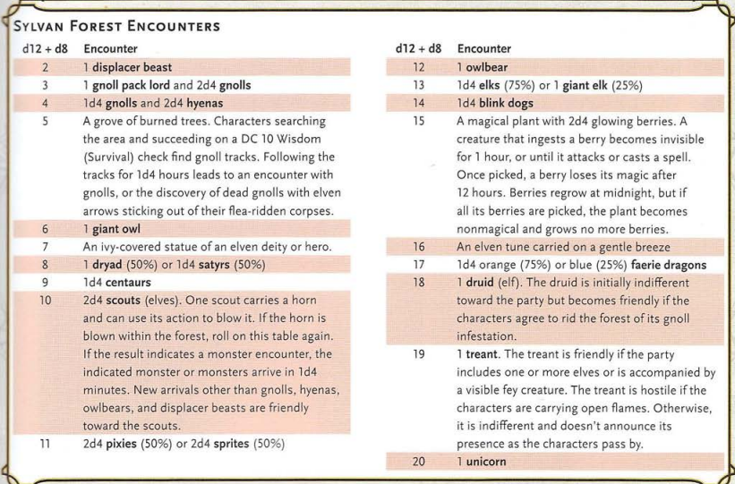

# Capstone Project 2 Proposals

1. First one that comes to mind is just polishing/refactoring the capstone 1 project. It has the basic structure that I had in mind, but I ran out of time to really polish the visuals, implement the grid system I had in mind, and otherwise make the app easy and more pleasent to use. Could also add a feature that tracks volume as well as weight for added granularity and fidelity of simulation.

2. Another Idea would be an TTRPG random encouter sharing service. Users could create individual random encounters and collect them into tables that could be made public to other users. Using the table would involve clicking a single button, the site running the parameters of the table, then providing the user with the stat block, PNG, and count of the monsters rolled in the random encounter. A custom API would be used to access the the monster details. Basically digitizing this:

3. Last idea would be an in-depth travel planner. Users would punch in events, flight times, public transportation options, etc. for wherever they are travelling to and can leave reviews and tips for other users going to the same place.